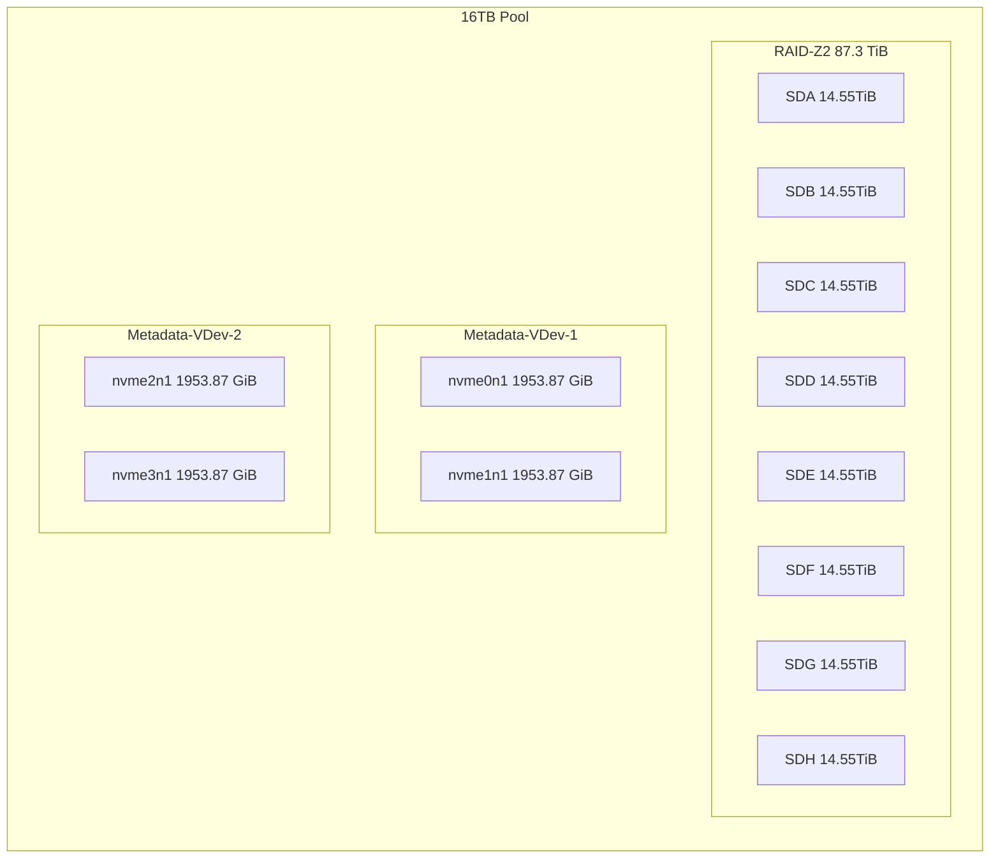

# TrueNas Scale Configuration 
## Introduction

I experimented with a couple of different configurations for my ZFS TrueNas pool.

My prefered setup is two vdev, created from times 4x 16TH hard drives in a RAID-Z config, where I can lose two hard drives if both vdev lose both one hard drive. I, in this case, have only one disk of redundancy. 

After discussing my config with people on /r/Truenas, /r/Datahoarders and /r/Homelab, people got upset and kept saying I should configure it with at least two drives of redundancy per vdev when using drives bigger than eight terabytes. 

The configuration they recommended is eight drives in a single vdev that will have a RAID-Z2 config. I can lose 2 HDDs in this config, but both HDDs can be in the same VDEV. The downside of this config is that if I run out of space and want to upgrade, I need to buy eight 16TB hard drives. 

I was doing some testing with the two vdev raid-z1 configuration. However, one of the hard drives failed. This HDD failing happened when the CHIA Coin was just released, and RMA or even buying a new 16TB HDD was tricky because there was no stock.

The hard drive failing and the difficulty sourcing more hard drives made me realise I should probably follow the recommended ZFS config and have a cold spare available (Which I did).

In the end, I choose the following config.

## ZFS Pool config

***

PS. Have I told anyone that I love, the mermaid markdown in github?

## Special Metadata vdev?
What you can see in this diagram is that there are two "Special" metadata vdev; these metadata vdevs are Samsung 980 Pro 2 TB SSDs. There are two drives in each vdev, and the SSDs are configured in a Mirror config.

These two metadata vdevs will give me 4 Terabytes of SSD storage, and I can lose at most 2 SSDs as long as I don't lose more than 1 per vdev.